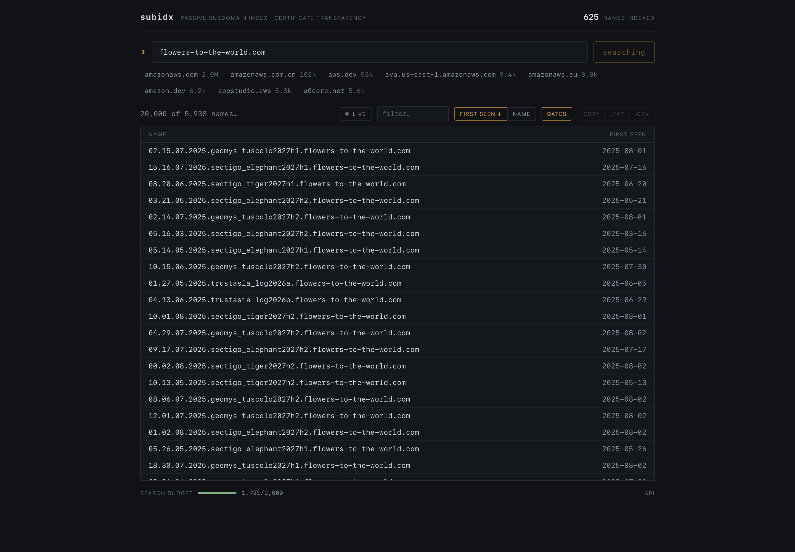

# subidx

Self-hosted passive subdomain enumeration from Certificate Transparency. subidx tails public CT logs (the records of every HTTPS certificate issued), indexes every hostname it sees, and serves them through a search API and dashboard you control. Think crt.name, but the data lives on your machine.



## Quick start

```
go build -o subidx .
./subidx tail -store ./data              # collect names (runs forever, Ctrl-C to stop)
./subidx serve -store ./data -addr :8099 # search what you collected
```

```
curl "http://localhost:8099/v1/search?apex=letsencrypt.org"
```

or open `http://localhost:8099/` for the dashboard: search any apex, filter and sort results instantly, toggle first-seen dates, export txt/csv, and watch a live feed of newly collected names. The UI is compiled into the binary; there is nothing extra to deploy.

## Why not just use subfinder?

Tools like [subfinder](https://github.com/projectdiscovery/subfinder) query other people's services at run time and inherit their quotas, captchas, and blind spots, and every run starts from zero. subidx pulls from the source once and owns the index:

- **Continuous coverage.** The tailer runs 24/7 with crash-safe resume; a certificate issued thirty seconds ago is already searchable.
- **First-seen timelines.** Every name carries its earliest seen date (`&dates=1`). Diff over time to catch new subdomains between engagements.
- **No keys, no quotas.** Your only dependencies are the log lists themselves.
- **Verified provenance.** Log keys are pinned against the log lists, tree heads are cryptographically verified, and each fetched batch must pass an RFC 6962 inclusion-proof spot check before it is stored.
- **Historical drains.** Years of history from retired logs can be backfilled, if you have the terabytes.
- **An API and dashboard, not just a CLI.** Pipe results into your tooling or browse them.

Honest limit: CT only sees names that were issued a certificate. Names that live only in DNS are invisible here, which is why subidx complements rather than replaces broader-source tools.

## How it works

1. **Discovery.** Every hour, subidx fetches Chrome's log lists (plus Apple's) and merges them. Live logs are tailed; old and rejected logs hold the drainable history (`-no-drain` to skip).
2. **Tailing.** Each log is polled every few seconds for new entries, up to 1000 per request, with a per-log watermark that never moves backwards across restarts.
3. **Parsing.** Entries are decoded just far enough to read the SAN list; everything else is discarded.
4. **Normalizing.** Names are lowercased, wildcards and trailing dots stripped, reserved names rejected, and each name assigned to its registered domain (apex) via the Public Suffix List.
5. **Storing.** A single writer inserts into an embedded Pebble store. Duplicates keep only the earliest date; nothing is deleted.
6. **Serving.** An HTTP API with rate limiting and health checks, plus the embedded dashboard.

## Commands

| Command | What it does |
|---|---|
| `tail` | Watch CT logs and store names. Runs until you stop it. |
| `serve` | Serve the API and dashboard. Add `-no-tail` to serve without collecting. |
| `stats` | Print total records and the top 10 domains. `-recount` fixes drifted counters. |
| `version` | Print the version. |

Useful flags:

| Flag | Default | Meaning |
|---|---|---|
| `-store` | `./data` | Where the database lives |
| `-addr` | `127.0.0.1:8080` | Listen address (binds localhost by default; use `:8080` to expose) |
| `-poll-interval` | `3s` | How often each log is checked for new entries |
| `-window` | `512` | Entries fetched per request while catching up |
| `-no-drain` | off | Skip old and rejected logs (years of history, terabytes). Works on `tail` and `serve` |
| `-rate-limit` | `1000` | Search requests allowed per IP per rolling 24 hours |
| `-max-results` | `100000` | Max results buffered per search query |
| `-allowed-hosts` | loopback names | Host header values to accept (blocks DNS rebinding; add your hostname when exposing) |
| `-cors-origins` | empty | Browser origins allowed to call the API from a separately hosted frontend |
| `-trusted-proxy-hops` | `0` | Proxies in front of you; 0 means X-Forwarded-For is ignored |

Only one process can use a store directory at a time; the database takes an exclusive lock.

## The API

`GET /v1/search?apex=example.com` returns one name per line:

| Case | Response |
|---|---|
| Known domain | `200`, one name per line |
| Unknown domain | `200`, empty body (not 404) |
| Not a bare domain | `400`, plain text reason |
| Missing `apex` | `400`, `missing apex parameter` |
| `&dates=1` | Tab plus first-seen date per line |
| `&format=json` | JSON array of `{"sub":"..."}` objects |
| `&format=ndjson` | One JSON object per line, flushed for streaming clients |
| HEAD | `405` |

Search responses carry `x-total-count` (names in the index for the apex) and `x-max-seq` (a cursor for change tracking). Search and stats are gzipped on request.

Live dashboards get two more endpoints:

- `GET /v1/watch?apex=X&after=N` — NDJSON of names collected since sequence `N`, with `x-max-seq` and `x-truncated`. A cheap "what changed" poll.
- `GET /v1/feed?apex=X` — server-sent-event stream of new names for that apex, one rate-budget unit per session. Slow consumers get a `resync` event instead of silent gaps.

Also: `/v1/stats` (`{"total":N,"top":[...]}`, optional `&n=`, cached, top-k bounded), `/healthz`, `/readyz`. Health endpoints skip the rate limit; everything else is counted.

## Deploying

No external database, ever: storage is an embedded Pebble directory on a persistent disk.

- **One Render service** (simplest). The repo ships `Dockerfile` + `render.yaml`: create a Blueprint, attach the 5 GB disk, done. The dashboard is inside the binary, so UI and API share the origin. Starter plan, ~$7/mo. A live instance runs at [subidx.onrender.com](https://subidx.onrender.com).
- **Vercel frontend + Render API.** Deploy `internal/web` to Vercel as a Vite project and set env `VITE_API_BASE=https://your-service.onrender.com`. Set the Render env `CORS_ORIGINS=https://your-dashboard.vercel.app` so the browser may call the API cross-origin (Render auto-redeploys on env changes). Live: [subidx.lverma.com](https://subidx.lverma.com) fronting the Render instance above.
- **Zero cost.** Run it at home and put it on your Tailnet.

Both paths auto-deploy on push to `main`. The API has no auth, so treat a public URL as a semi-private link.

## What gets stored

Three facts per name: the apex (registered domain), the full subdomain, and `first_seen`, the earliest date it appeared in any watched log. Multi-level names are kept whole, so `ap.www.sandbox.namecheap.com` is one record under `namecheap.com`.
